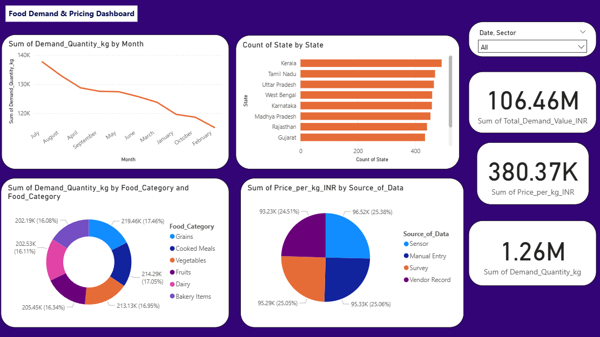

# 🍽️ Food Waste Tracking Dashboard

## Overview

This project is an interactive Power BI dashboard developed to monitor food donations, food wastage, demand forecasting, and NGO distribution.

## Features

- Food Donation Analysis
- Food Wastage Monitoring
- Demand Forecasting
- NGO Performance
- Interactive Filters
- KPI Cards
- Trend Analysis

## Dashboard Preview

### Main Dashboard

> Replace `dashboard.png` with your actual screenshot filename if it is different.

## Tools Used

- Power BI
- Microsoft Excel
- DAX
- Power Query

## Files Included

- `Food_Waste_Dashboard.pbix`
- `README.md`
- `dashboard.png`

## Future Enhancements

- Real-time SQL Database Integration
- Machine Learning Prediction
- Automated Refresh
